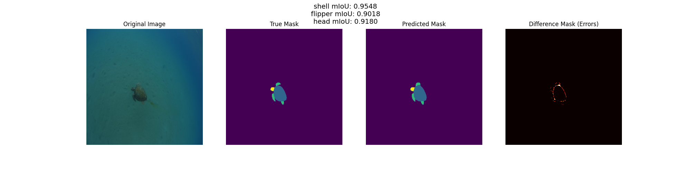

# COMP9517 Computer Vision 24T3
# Group Project ：Turtle Segmentation Project 🐢

## 👥 Team: the avenger 🛡️🦸‍♂️🕸️🖤🔨
🛡️ YuFeng Jiang  z5472786
🦸‍♂️ Shuo Yang z5447094
🕸️ Yuchen Mei  z5500051
🖤 Yining Liu z5466010
🔨 Simon Liu z5496297

## Table of Contents

- [Project Background](#project-background)
- [MODEL](#model)
  - [Unet_Improved_Miou](#unet_improved_miou)
    - [Environment Setup](#environment-setup)
    - [How to Run](#how-to-run)
      - [Testing](#testing)
      - [Training](#training)
    - [Evaluation](#evaluation)
      - [UNet Training Result](#unet-training-result)
      - [UNet Testing Result](#unet-testing-result)
      - [UNet Example-output](#unet-example-output)
    - [Contributor](#contributor)

  - [YOLO](#yolo)
    - [YOLO Environment Setup](#yolo-environment-setup)
    - [YOLO Data Process](#yolo-data-process)
    - [YOLO How to Run](#yolo-how-to-run)
      - [YOLO Testing](#yolo-testing)
      - [YOLO Training](#yolo-training)
    - [YOLO Result](#yolo-result)
      - [Results of mIOU](#results-of-miou)
      - [YOLO Example-output](#yolo-example-output)
    - [YOLO Contributor](#yolo-contributor)

  - [FCN](#fcn)
    - [FCN Environment Setup](#fcn-environment-setup)
    - [FCN How to Run](#fcn-how-to-run)
    - [FCN Result](#fcn-result)
      - [FCN ASPP Result](#fcn-aspp-result)
    - [FCN Contributor](#fcn-contributor)

  - [UNet](#unet)
    - [UNet Environment Setup](#unet-environment-setup)
    - [UNet How to Run](#unet-how-to-run)
    - [UNet Result](#unet-result)
      - [UNet ASPP Result](#unet-aspp-result)
    - [UNet Contributor](#unet-contributor)

  - [Mean Shift](#mean-shift)
    - [Mean Shift Environment Setup](#mean-shift-environment-setup)
    - [Mean Shift Result](#mean-shift-result)
      - [Mean Shift Testing Result](#mean-shift-testing-result)
      - [Mean Shift Example-output](#mean-shift-example-output)
    - [Mean Shift Contributor](#mean-shift-contributor)

  - [DeepLabV3](#deeplabv3)
    - [DeepLabV3 Environment Setup](#deeplabv3-environment-setup)
    - [DeepLabV3 How to Run](#deeplabv3-how-to-run)
    - [DeepLabV3 Contributor](#deeplabv3-contributor)
      
    

## Project Background

The Turtle Segmentation Project aims to implement semantic segmentation on turtle images, focusing on identifying and differentiating key anatomical parts such as the head, flippers, and shell. This segmentation task is critical for monitoring and studying turtles, as well as supporting research and conservation efforts. The project utilizes models including `UNet`, `FCN`, `YOLOv8-seg`, `Mean Shift`, and `DeepLabV3`. Each model is trained and evaluated using the `turtles-data` dataset.

The primary objectives of this project include:
- Developing a reliable segmentation pipeline tailored for turtle images.
- Testing and comparing different segmentation architectures (UNet, YOLOv8-seg, FCN, Mean Shift, and DeepLabV3).
- Providing a modular and scalable solution for data processing, model training, evaluation, and visualization of segmentation outputs.

This project also includes essential tools and scripts for data handling, model performance tracking, and detailed result visualization. We evaluate the segmentation accuracy using metrics such as Mean Intersection over Union (mIoU), class-wise mIoU, and other relevant performance metrics. 

## MODEL 

### Unet_Improved_Miou
`Unet` is a popular architecture for image segmentation. 
This Unet model has a higher mIoU compared to another Unet model in this group. 
This Unet model is implemented using the segmentation_models_pytorch library and is optimized for the sea turtle segmentation task. The sections below outline the required environment setup, how to run the code, and the evaluation results for this model.

#### Environment Setup

Before running the code, please ensure the following dependencies are installed:

- Python 3.7+
- PyTorch
- segmentation_models_pytorch
- torchvision
- tqdm
- pandas
- scikit-learn
- matplotlib
- pycocotools

Install these dependencies with the following command:

```bash
pip install torch torchvision segmentation-models-pytorch tqdm pandas scikit-learn matplotlib pycocotools
```

Or install dependencies
   ```bash
   pip3 install -r requirements.txt
   ```

#### How to Run
##### Because pre-trained model is so large over 100MB. I upload it to google drive.
##### Please! Please! Please!
##### Download [pre-trained model](https://drive.google.com/file/d/1ViYOYjBqGGWS6Ojrj2QwRpgUehWpf_S2/view?usp=sharing) first.
##### And put it in folder named TurtleUnet. 

##### Testing

Check the image and metadata_splits pathes in test and evaluate, then run:

```
python evaluate.py
```

##### Training

To train the model, you need to first prepare our [Turtle dataset](https://drive.google.com/drive/folders/1dQZ52oFaJk2JWWjI7o3xMJBUsMXf2H6e?usp=drive_link), and metadata_splits.csv file [metadata_splits.csv](https://drive.google.com/file/d/1OpMF-e619qX1qpqtxhLb_A9e1nCA-lJI/view?usp=sharing).

Check the image and metadata_splits pathes in test and evaluate, then run:
```
python train.py
```

#### Evaluation

Below is an example of the model's predicted outputs, showing the original image, true mask (ground truth), predicted mask by the model, and a difference mask that highlights the errors.

#### UNet Training Result


#### UNet Testing Result


#### UNet Example-output 




In these examples:
- **Original Image**: The raw image from the dataset.
- **True Mask**: The ground truth segmentation mask, where each color represents a different part of the turtle (yellow for the head, green for flippers, and blue for the shell).
- **Predicted Mask**: The segmentation mask predicted by the model. The model has accurately identified the main parts of the turtle.
- **Difference Mask (Errors)**: Shows the areas where the predicted mask differs from the true mask. The red outlines indicate areas where the model's predictions did not perfectly align with the ground truth.

#### Contributor
🖤 Yining Liu z5466010

---
### YOLO

#### YOLO Environment Setup

Before running the code, please ensure the following dependencies are installed:

ultralytics==8.3.27
matplotlib==3.9.0
pycocotools==2.0.8
tqdm==4.66.4
scikit-image==0.24.0
scikit-learn==1.5.0
pandas==2.2.2
numpy==1.26.4
opencv-contrib-python==4.10.0.84
opencv-python==4.10.0.84
torch==2.3.0+cu121
torchaudio==2.3.0+cu121
torchmetrics==1.4.0.post0
torchvision==0.18.0+cu121
ultralytics==8.3.27
ultralytics-thop==2.0.10
Install these dependencies with the following command:

```bash
pip install torch torchvision segmentation-models-pytorch tqdm pandas scikit-learn matplotlib pycocotools
```
#### YOLO Data Process

Download the dataset:[Turtle dataset](https://drive.google.com/drive/folders/1dQZ52oFaJk2JWWjI7o3xMJBUsMXf2H6e?usp=drive_link)
and [metadata_splits.csv](https://drive.google.com/file/d/1OpMF-e619qX1qpqtxhLb_A9e1nCA-lJI/view?usp=sharing)

```
python data_process.py
```

The processed dataset including three folders: yolo_train_labels, yolo_valid_labels, yolo_test_labels. All of them have two folders: images and labels. Labels are converted to YOLO format and correspond to the images.
#### YOLO How to Run

Download the yaml file: [yolo_seg_config.yaml](https://drive.google.com/file/d/1uUu4bwInIlmgTx8n41baV9tzRtb7GmHl/view?usp=sharing)

##### YOLO Testing

Check the dataset path and then run:
Use the pretrained model [yolov8-seg-trained.pt](https://drive.google.com/file/d/1TX9av2Ss2DJ-0kCEhCI50WUN79WnUZih/view?usp=sharing).

```
python test.py
```

##### YOLO Training

Check the dataset path and then run:
```
python train.py
```

#### YOLO Result
#### Results of mIOU

| Class     | Box (mAP50) | Box (mAP50-95) | Mask (mAP50) | Mask (mAP50-95) |
|-----------|-------------|----------------|--------------|-----------------|
| all       | 0.79        | 0.622          | 0.785        | 0.6             |
| carapace  | 0.456       | 0.356          | 0.46         | 0.372           |
| head      | 0.965       | 0.72           | 0.949        | 0.682           |
| flipper   | 0.949       | 0.792          | 0.946        | 0.744           |

#### YOLO Example-output 


#### YOLO Contributor
🦸‍♂️ Shuo Yang z5447094

---

### FCN

- #### FCN Environment Setup
  1. Ensure the `turtles-data` dataset folder is downloaded and placed in the project root directory.
  2. Install the necessary dependencies by running:
     ```bash
     pip install -r requirements.txt
     ```

- #### FCN How to Run
  1. To train the `FCN` model:
     ```bash
     python train_FCN.py
     ```
  2. To train the `FCN+ASPP` model:
     ```bash
     python train_FCN_ASPP.py
     ```
  3. To evaluate the performance of the `FCN` model:
     ```bash
     python test.py
     ```
- #### FCN Result

- #### FCN+ASPP Result


- #### FCN Contributor
🛡️ YuFeng Jiang  z5472786

---
### UNet

- #### UNet Environment Setup
  1. Download the `turtles-data` dataset and place it in the project root directory.
  2. Install the required dependencies by running:
     ```bash
     pip install -r requirements.txt
     ```

- #### UNet How to Run
  1. To train the `UNet` model:
     ```bash
     python train_UNet.py
     ```
  2. To train the `UNet+ASPP` model:
     ```bash
     python train_UNet_ASPP.py
     ```
  3. To evaluate model performance (e.g., calculate IoU) using `test.py`:
     ```bash
     python test.py
     ```
- #### UNet Result

- #### UNet+ASPP Result


- #### UNet Contributor
🕸️ Yuchen Mei  z5500051

---

### Mean Shift

- #### Mean Shift Environment Setup

  1.Before running the code, ensure the following libraries are installed:
  ```bash
  pip install tensorflow pycocotools numpy pandas scikit-learn opencv-python
  ```

        mean shift
  1.mount Google Drive and set the data file paths:
    ```python
    from google.colab import drive
    drive.mount('/content/drive')
    ```
    Ensure the following files are in the specified Google Drive path:
    - **metadata_splits.csv**: A metadata file for data splits.
    - **annotations.json**: Annotation data in COCO format.

  2.Run the following command to process the data:

    ```bash
    python data_process.py
    ```
  3.Run `train.py` in Google Colab to train the model. The script uses the training and validation splits specified in the dataset:
    ```bash
    python train.py
    ```
  4.Run `test.py` to evaluate the model’s performance. The script will load the validation data and print the Intersection over Union (IoU) score for each class:
    ```bash
    python test.py
    ```
- #### Mean Shift Result
   - #### Mean Shift Testing Result
      - **Background IoU**: 0.2408
      - **Head IoU**: 0.0678
      - **Flippers IoU**: 0.0270
      - **Shell IoU**: 0.0175

   - #### Mean Shift Example-output
      


- #### Mean Shift Contributor
🔨 Simon Liu z5496297

--- 


### DeepLabV3

- #### DeepLabV3 Environment Setup

  1.Pip install tensorflow pycocotools numpy pandas scikit-learn opencv-python matplotlib tqdm
  2.Ensure the following files are available:
      metadata_splits.csv: Metadata file for splitting the data.
      annotations.json: Annotations for the dataset, stored in the COCO format.
    
- #### DeepLabV3 How to Run

  1.From google.colab import drive
    drive.mount('/content/drive')
  2.Python data_process.py
  3.Python train.py
  4.To visualize predictions, run the visualize_predictions() function in test.py

- #### DeepLabV3 Contributor
🔨 Simon Liu z5496297

---
